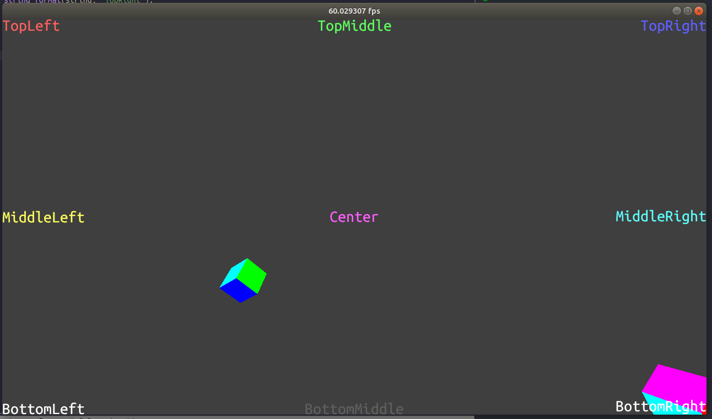

# vkRenderer

This is the repository of a 3D renderer written in C++.

## Notes

This project is voluntarily not written in modern C++. My motivation for this choice is that modern C++ is unbearably slow to compile and not using templates is a big boost in terms of compilation speed.

## Screenshots

